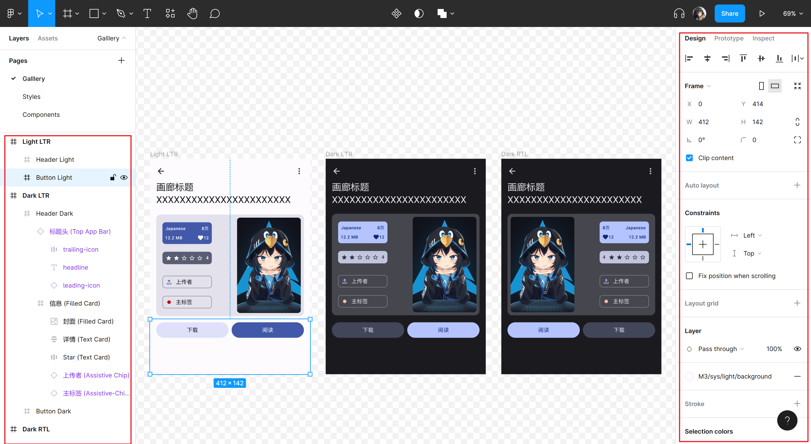

# EhViewer Design

This repository is part of [EhViewer](https://github.com/asuka-mio/Ehviewer)

## Usage

1. Create an account (if not have) and login to [Figma](https://www.figma.com)

2. Download EhViewer.fig in repo then import it to your Figma account
   

3. Double-click the draft you have just imported to open it
   

4. (Recommend) Install plugin listed in [Thanks - Plugin](#plugin)
   

### Useful Tips for Figma

1. Views and overlays list on the left, information of selected view listed on the right.
   

2. Hold on `Alt` key to show the distance between each views

   https://user-images.githubusercontent.com/41893946/180967821-a6a3c3e7-940a-4bc9-acf0-7f1d3a92f787.mp4

3. Click on `Enter` or `Shift+Enter` to "zoom" between different views

   https://user-images.githubusercontent.com/41893946/180967949-1b9ef4a4-d36d-4ae8-86ef-e019f6e03a37.mp4

More tips about Figma can get from search Engine :)

## Thanks

### Plugin
  + [Material Theme Builder Plugin](https://www.figma.com/community/plugin/1034969338659738588/Material-Theme-Builder)
### Design kit
  + [Material 3 Design Kit](https://www.figma.com/community/file/1035203688168086460)
### Design Tool
  + [Figma](https://www.figma.com)
